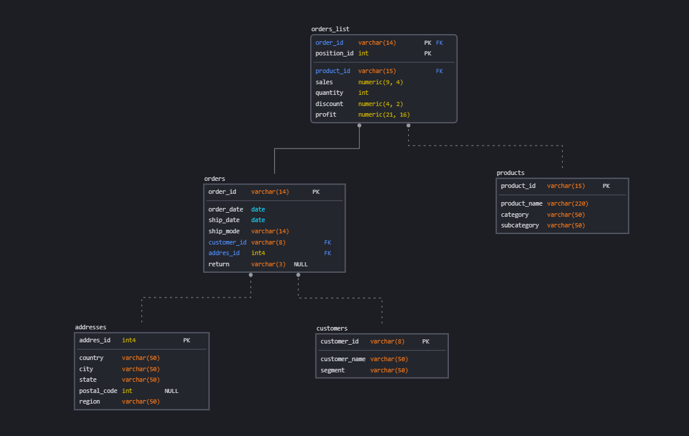

# Описание задачи

Это решение задания к модулю 2 курса [DE-101 Analytics (Data) Engineering](https://github.com/Data-Learn/data-engineering/blob/master/DE%20-%20101%20Guide.md) 

**Что было сделано:**
- Запущены две копии БД PostgreSQL: локально и на сервисе [supabase.com](https://supabase.com/). 
- Заполнены сырыми данными из датасета SuperStore напрямую с помощью скриптов (схема stg).
- Создана схема базы данных в сервисе SqlDBM:

- Схема реализована и заполнена данными из схемы stg в схеме dw ([скрипт](./DDL_to_dw.sql)). 
- К облачной БД подсоединен Yandex DataLens и реализован  [дашборд](./dashboard/readme.md)

